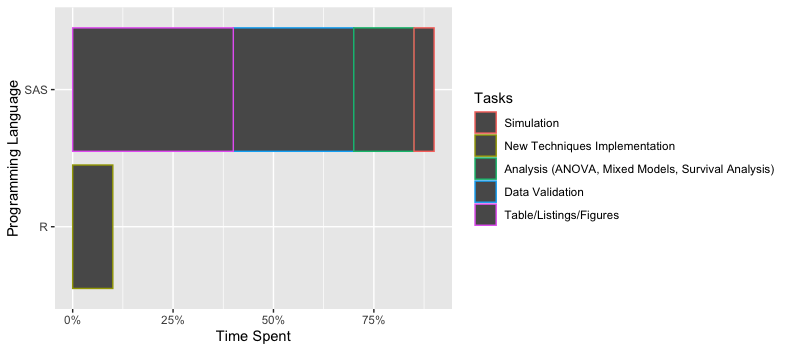
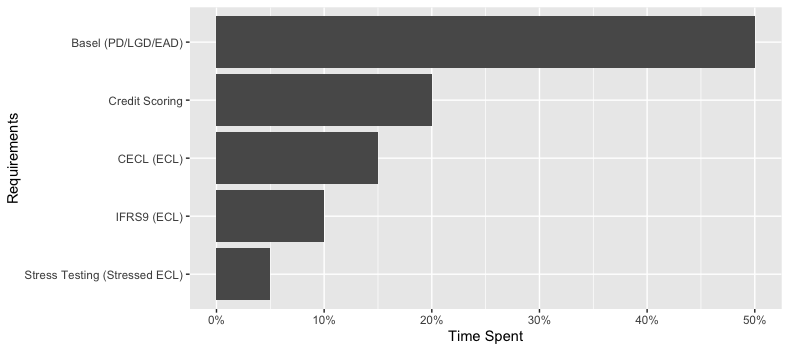

### Hi there 👋

<!--
**southwest-qh/southwest-qh** is a ✨ _special_ ✨ repository because its `README.md` (this file) appears on your GitHub profile.

Here are some ideas to get you started:

- 🔭 I’m currently working on ...
- 🌱 I’m currently learning ...
- 👯 I’m looking to collaborate on ...
- 🤔 I’m looking for help with ...
- 💬 Ask me about ...
- 📫 How to reach me: ...
- 😄 Pronouns: ...
- ⚡ Fun fact: ...
-->

I've worked in both banking and pharmaceutical industry doing analytics in total for 9 years. 
- 🏔 Two years tenure in pharmaceutical industry.
  - ✨ __90%__ SAS skills used later learnt in this journey
  - ✨ Most "statistically" significant industry
   
  
- 🏛 Seven years tenure in analytics and modeling in credit risk for lending book.
  - ✨ Modeling for Banking regulatory requirements
  
  
- 🔭 I’m currently working on:
  - Maintaining my Data Science Playground repository which includes
    - Credit risk modeling quick start 
      - summary of the analytics toolbox I've used over the years 
      - sample projects using public available data
    - Machine learning (ML) concepts and methodology simply explained
    - Miscellaneous projects using the ML techniques and tech-stacks: data visualization, flask app for model development, etc.
  
- 🌱 I’m currently learning:
  - Marketing Analytics
  - Recommender Systems
  - Pyspark
